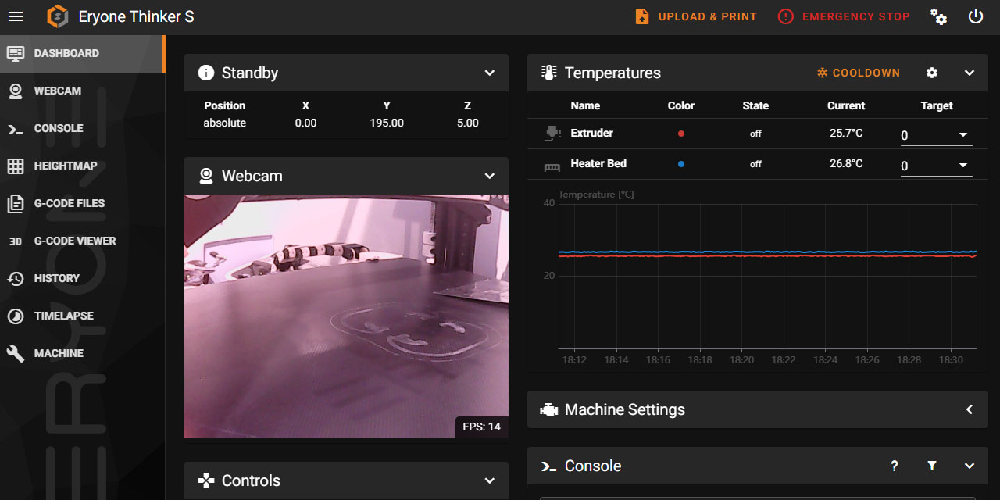

# Mainsail Eryone Theme
An Eryone theme for [Mainsail](https://docs.mainsail.xyz/)



## Install Manually
You need mainsaill already installed on your machine, open your browser and search your 3D printer IP.

In mainsail: go to settings -> machine -> add a folder called .theme

Make sure to enable "Hidden files" under the gear icon 

Now, inside .theme, add these files:
```
custom.css
favicon-16x16.png
favicon-32x32.png
sidebar-background.svg
sidebar-logo.svg
```
## Install via Git
```bash
git clone https://github.com/dapostol73/MainsailEryoneTheme.git ~/klipper_config/.theme
```
## Update via Git
```bash
git -C ~/klipper_config/.theme pull
```

## License
[GNU LICENSE](./LICENSE)

## More
* Find more themes at [Mainsail Docs - Theming](https://docs.mainsail.xyz/theming)
* How to Install Mainsail Themes [YouTube](https://youtu.be/kbSfLQtl4tA) 